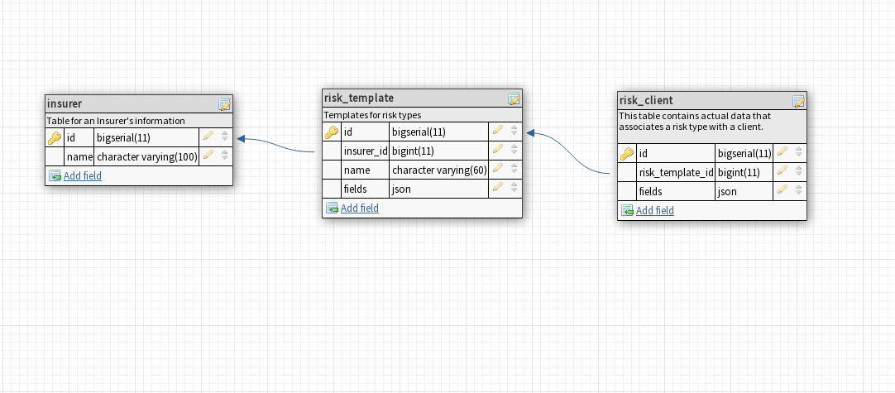

# britecore-productdev

This implementation uses Flask and PostgreSQL so make sure you have `PostgreSQL` installed before you proceed.

The Frontend is an SPA built with `Vue.js` and `vue-router` for navigation.

## Frontend setup

Install the dependencies from npm with:

```bash
cd frontend

npm install
```

Bundle the Vue app and all it's dependencies with:

```bash
npm run build
```

This creates a new folder containing with all the assets that can be served from Flask.

If you need to make changes to the code, you can start the webpack development server with:

```bash
npm run dev
```

and re-build the application when you're done.

On the Flask API server, CORS has been enabled so you shouldn't have problems making requests to the server when you're developing locally.

## Flask setup

Install the python requirements with:

```bash
pip install -r requirements.txt
```

set the flask app to app.py with:

```bash
export FLASK_APP=app.py
```

Optionally, you can set the `DEBUG` mode with:

```bash
export FLASK_DEBUG=1
```

Create the database with:

```bash
flask createdb
```

***Note: this creates a database named britecore if it doesn't exist. If it exists, it would be destoryed and recreated***

Finally start the flask development server with:

```bash
flask run
```

Navigate to `http://localhost:5000` and you should see the `Vue` SPA rendered in the browser.

### API endpoints

- ***risks*** -> Returns a list of all risks in the database.

- ***risks/<risk_id>*** -> Returns a single risk.

### Rationale



I created two tables to manage the Risks namely `risk_template` and `risk_client`. A risk template is the base template for a Risk type, it only contains custom fields and their default values. The `risk_client` table stores information for each client an Insurer wants to manage.

Each `RiskClient` is related to a `RiskTemplate` (through the `risk_template_id` Foreign key) where it was created from, Updates to the `RiskTemplates` Such as addition of new fields, Renaming of existing fields etc can be propagated to all existing `RiskClients` if desired.

The `insurer` table contains information about an insurer.

My approach uses JSON Specifically `JSONB` columns in `PostgreSQL` to overcome the problem of user defined columns. `MySQL` and `SQLite` also support `JSON` fields.

Another popular approach that could be used to tackle this problem is The [Entity Value Approach (EAV)](https://en.wikipedia.org/wiki/Entity%E2%80%93attribute%E2%80%93value_model) but this approach comes with it's own downsides which include Empty columns and unnecessary joins between the metadata table and the fields table which could cause degraded performance as the table size increases.

With the `JSON` approach each custom field is stored as JSON alongside it's metadata (The field name, data type etc) and any custom information about the field.

This an example of a response returned from the `risk/<risk_id>` endpoint.

```JavaScript
{
  "fields": [
    {
      "dataType": "text",
      "name": "Customer Name",
      "value": ""
    },
    {
      "dataType": "enum",
      "name": "Type",
      "options": [
        "Car",
        "MotorCycle",
        "Truck"
      ],
      "value": ""
    },
    {
      "dataType": "integer",
      "name": "Accidents",
      "value": "0"
    },
    {
      "dataType": "currency",
      "name": "Value",
      "value": 0
    },
    {
      "dataType": "date",
      "name": "Last Renewed",
      "value": "2018-01-01"
    }
  ],
  "id": 1,
  "name": "Automobile"
}
```

This makes it easy to set default values for each field with the `"value"` key and for Integer fields we could even do some fancy things like setting max and min values which can be used on the Vue frontend for client side validation For example, we can do this:

```html
<input type="number" :min="risk.minValue" :max="risk.maxValue">
```

*where risk is a risk object fetched from the /api/<risk_id> endpoint*

It also makes it ridiculously simple to update field values and their structure, We just need to replace the existing JSON with the new structure and values we want.

The code for the API is also straight forward since we're mostly returning existing `JSON` from the database.

On the performance side, `JSON` fields in postgres can be queried like normal columns, they can be searched, sorted, filtered, grouped etc. They can also be indexed to speed up the queries.

In conclusion, using `JSON` fields gives us the flexibility of `NoSQL` databases without losing the benefits of a Relational Database.

### Admin interface

I also provided an admin interface (thanks to Flask-admin) to view and change the structure of a risk template.

it can be accessed by navigating to `/admin/`

### Unit tests

Does this code actually work? Yes it does.
The tests are written and run with the standard `unittest` module You can run the tests with:

```bash
python tests.py
```
